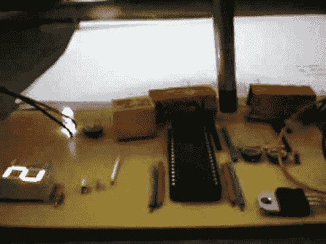

# 照明控制器计算一个房间里有多少人

> 原文：<https://hackaday.com/2012/07/25/lighting-controller-counts-how-many-people-are-in-a-room/>

[Deekshith Allamaneni]制造了这个控制器，它将自动打开和关闭房间里的灯。没什么大不了的，对吧？你已经可以在家庭商店里买到一个替换的电灯开关来帮你做到这一点。但是有一个很大的不同。我们看到的商业解决方案仅仅依赖于运动传感器和定时器。但是[Deekshith]找到了一种方法来计算进入一个房间的人数，当第一个人进入时开灯，当最后一个人离开时关灯。

休息后的视频展示了他的测试设备的演示。起初，我们只是认为这只是在计算一个物体在传感器之间经过的次数。但是它也可以检测物体行进方向。现在这个系统只需要扩大规模就可以在门口使用了。

对于没有任何电灯开关的房子来说，这将是一个很好的补充。

[https://www.youtube.com/embed/P7ZvpLM5VFE?version=3&rel=1&showsearch=0&showinfo=1&iv_load_policy=1&fs=1&hl=en-US&autohide=2&wmode=transparent](https://www.youtube.com/embed/P7ZvpLM5VFE?version=3&rel=1&showsearch=0&showinfo=1&iv_load_policy=1&fs=1&hl=en-US&autohide=2&wmode=transparent)