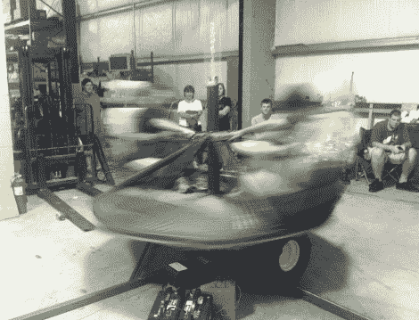

# 旋转-地狱般的游戏

> 原文：<https://hackaday.com/2012/07/25/spinning-hell-of-a-game/>

北街实验室真的把他们的‘A’游戏带到了红牛创造大赛的建造决赛。看看中间派，他们的旋转地狱游戏。你真的看不出来(因为旋转),但这个游戏由两个桶形座位组成，它们在旋转木马式的甲板上相对放置。每个玩家面前都有一个按钮，必须按住这个按钮，装备才能开始旋转。当你再也受不了时，只需松开按钮，旋转就会停止。但是你也会输掉这场比赛。谁能坚持得更久，谁就赢了。

看到如此完美的身材并不奇怪。毕竟这是[打造西蒙](http://hackaday.com/2012/07/04/the-most-surprising-game-of-simon-youve-every-played/)的暴力震动游戏的同一个团。这一次，大部分工作以工程和焊接的形式出现。首先，他们必须确保设计能够承受这东西产生的力量，然后他们必须建造它。而且都在 72 小时的时限内。我们不确定哪个更难，赢得比赛还是休息后看视频时尽量不笑。

[https://www.youtube.com/embed/NSBUboC7toM?version=3&rel=1&showsearch=0&showinfo=1&iv_load_policy=1&fs=1&hl=en-US&autohide=2&wmode=transparent](https://www.youtube.com/embed/NSBUboC7toM?version=3&rel=1&showsearch=0&showinfo=1&iv_load_policy=1&fs=1&hl=en-US&autohide=2&wmode=transparent)