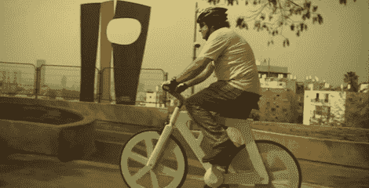

# 纸板做的自行车太便宜了，偷不了

> 原文：<https://hackaday.com/2012/07/26/bike-made-from-cardboard-is-too-cheap-to-steal/>

如果你曾经不得不更换一辆自行车，[Izhar Gafni]是你的人。他创造了一辆完全由硬纸板制成的自行车，这种自行车足够结实，可以支撑最大的骑手，价格和麦当劳的套餐差不多。

[Izhar]的自行车由不同厚度的纸板制成，最厚的纸板大约一英寸宽。在将这些硬纸板切割并粘合在一起后，[Izhar]将它们浸在树脂中，刷上一点油漆，创造出一辆非常坚固、非常轻且非常便宜的自行车。

[Izhar]说，每辆自行车的生产成本约为 10 美元，估计可以卖到 60 至 90 美元，甚至比最便宜的金属自行车还便宜。如果你的自行车被偷过，你就会知道更换主要交通工具的痛苦。[Izhar]说他的自行车太便宜了，小偷都懒得从你手里拿走。

休息之后，你可以看看[Izhar]制作纸板自行车的精彩视频。

[https://player.vimeo.com/video/37584656](https://player.vimeo.com/video/37584656)