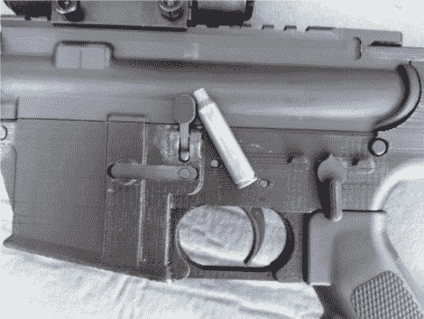

# 3D 打印 AR-15 下部作品

> 原文：<https://hackaday.com/2012/07/26/3d-printed-ar-15-lower-works/>

Ar15.com 用户[HaveBlue]已经在一个 [3D 打印的下部接收器](http://www.ar15.com/forums/t_3_118/579913_3D_printed_lower___yes__it_works_.html)上工作了一段时间，现在报告说零件完全正常工作。使用 90 年代的 Stratasys 3D 打印机[HaveBlue]设法从 cncguns.com 生产出一个已经上市的模型的修改版本。他加固了拆卸凸耳的孔，这些凸耳将步枪的上半部分和下半部分固定在一起。加强了枪栓固定凸耳，当弹匣空了的时候，它会抬起一个杠杆组件，当枪栓弹回把另一发子弹推进枪膛的时候，杠杆组件会抓住枪栓。并增加了一个完整的扳机保护装置，也就是环绕扳机的杆。

从法律上来说，这种印刷是一个名副其实的国家和联邦法规的挑战。至少在美国是这样。下部接收器是步枪的一部分，它容纳弹簧和销，用于操作步枪的扳机保险和锤子组件，将弹匣保持在适当的位置，并安装枪托/回位弹簧管。关于下部接收器的另一个关键点是，它包含主要的可追踪识别标记，即序列号。下部接收器中包含的所有零件都可以在线订购(这因州而异)。事实上，步枪的每一个其他部分都可以自由买卖。这种步枪唯一不能在网上订购，并且需要在枪支商店进行背景调查的部件是下部接收器的主体(我们必须坚持说这因州而异)。一般来说，法律允许制造没有序列号的零件，只要它从未出售给其他个人(同样，各州的法律差异很大)。

在[HaveBlue]的网站[这里](http://haveblue.org/?p=1041)和[这里](http://haveblue.org/?p=1321)有更多关于这个版本的信息，但是目前已经关闭。这种 3D 打印超越了 [nerf gun](http://hackaday.com/2011/04/02/3d-printed-gun-fires-nerf-darts/) 阶段，但我们已经看到了 [shot gun](http://hackaday.com/2011/02/07/home-built-revolving-shotgun/) 和[手枪](http://hackaday.com/2008/06/03/cnc-milling-gun-parts/) hacks。