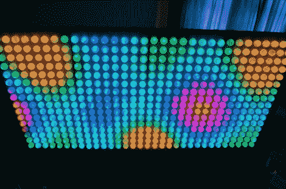

# 许多乒乓球组成的更大的彩虹板

> 原文：<https://hackaday.com/2012/07/27/a-much-larger-rainbow-board-of-many-ping-pongs/>

[George]从一个 8×8 的网格开始，但是无法控制自己从[升级到这个 32×16 像素的乒乓球显示器](http://dashroom66.org/2012/07/the-much-larger-board-of-many-ping-pong-balls/)。没错，这是一个完全可寻址的 RGB LEDs 的 512 像素阵列，每个阵列扩散有一个乒乓球。

我们在一月份介绍了这个项目的前身。那是一个 8×8 的显示器，使用 Rainbowduino 作为控制器。[乔治]把他从那座建筑中学到的东西用在了它上面。较大的显示器是模块化的。每个模块从一个 8×8 网格开始，使用一个分支屏蔽连接回 Arduino，一些以太网插孔用作快速连接。led 由 595 个移位寄存器驱动，晶体管保护逻辑芯片免受开关电流的影响。

他得到了很多帮助来焊接显示器的所有连接，并最终在曼彻斯特迷你制造商博览会上展示了它。休息之后，请观看视频中的实际操作。

[https://www.youtube.com/embed/-A1ZEgLELtQ?version=3&rel=1&showsearch=0&showinfo=1&iv_load_policy=1&fs=1&hl=en-US&autohide=2&wmode=transparent](https://www.youtube.com/embed/-A1ZEgLELtQ?version=3&rel=1&showsearch=0&showinfo=1&iv_load_policy=1&fs=1&hl=en-US&autohide=2&wmode=transparent)