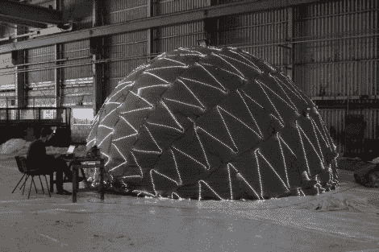

# 为燃烧的人建造一个人造月亮

> 原文：<https://hackaday.com/2012/07/27/building-an-artificial-moon-for-burning-man/>

如果你有幸获得今年“燃烧的人”的入场券，一定要留意[劳伦斯·西蒙兹]和工作人员，他们正在为这一事件组织一场雄心勃勃的比赛。事实上，我们猜测你不用看多远就能发现他们巨大的月亮复制品漂浮在头顶上——事实上，这可能很难错过。

他们称这个雕塑为“新月和潮汐”，它是一个 8 米宽的内部发光的月亮，盘旋在一个同样大的旋转平台上。这个充气球由巨大的防撕裂尼龙面板组成，里面有 36000 多个缝在里面的发光二极管。led 照亮球体以反映月亮的自然颜色，尽管通过简单的命令，[劳伦斯]和他的公司可以随心所欲地改变照明。

如果 Hack a Day 的杰西·康登(Jesse Congdon)今年再次参加电影节，我们肯定他会看到 Lune 和 Tide 的一些镜头。现在，您必须通过查看项目的构建日志来满足您的好奇心。