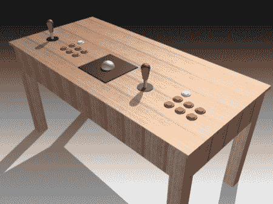
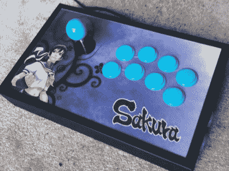

# 一种无线 MAME 茶几控制器

> 原文：<https://hackaday.com/2012/07/28/a-wireless-mame-coffee-table-controller/>

虽然我们在这里已经展示了相当多的 MAME 控制器，但我们认为我们应该再展示一个。在这一点上，这只是一个精心绘制的机械计划，但如果结果像模型或详图一样，我们将会印象深刻。

特别感兴趣的是[计划零件清单](http://coffeecontroller.wordpress.com/2012/07/26/hello-world/ "Mame planned parts list")。其中有典型的操纵杆、按钮，甚至是轨迹球。对我们的一些读者来说，新的可能是由[Wayne 和 Layne]开发的[蓝牙街机控制器](http://www.wayneandlayne.com/projects/bluetooth-arcade-controller/ "bluetooth arcade controller")开源硬件套件。虽然它们不便宜，不到 80 美元，并且需要一个 Arduino Mega 来使用，但这仍然是一个有趣的控制选项。最大按钮按压可能是 6 的另一个限制因素，但是这应该是比拆卸一个或多个无线控制器更干净的解决方案。

当然，如果我们没有至少给你一个完整的 MAME 控制器的链接，那我们就是疏忽了。如果你想要一些完成的控制器视觉糖果或在休息后检查一下图片，请务必在这些图片上大饱眼福！

Via [ [Reddit](http://www.reddit.com/r/DIY/comments/x7mrp/starting_a_coffee_table_arcade_controller_and/ "reddit article") 和[这篇文章](http://www.reddit.com/r/somethingimade/comments/x8b10/i_built_a_fightstick_for_playing_street_fighter/?already_submitted=true "reddit article")也是如此。