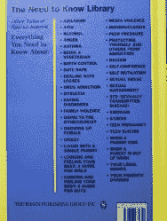

# 书评:电脑黑客的危险

> 原文：<https://hackaday.com/2012/07/29/book-review-the-dangers-of-computer-hacking/>

 多年以前，有人把这本书作为礼物送给了我。一位合著者认为我可能会觉得这很有趣。这本书名为[电脑黑客的危险](http://www.abebooks.com/servlet/SearchResults?an=john+knittel&sts=t&tn=dangers+of+computer+hacking)，是一个小学级别的电脑黑客及其危险的分类。当时，我觉得这很有趣。从那以后，它就一直坐在我的书架上，没有太多动作。

然而，上周末，我 8 岁的儿子正在为他的 slinky(新的塑料 slinkies suck)建造完美间隔的形状，并发现了这本书。我抓起它，并通过它真正快速阅读。我意识到，虽然这有点开玩笑(查看封底的主题)，但这本书实际上是未入门者的绝佳参考。

他们设法推出了一个相当不错的黑客历史，同时保持其简短和易于消费。请记住，这本书的重点是“计算机黑客”，所以他们触及了像[史蒂夫·沃兹尼亚克]这样的黑客对计算机行业的影响。“黑客”和“破解”有什么区别，甚至跳到如何在自己家里安全地练习“黑客”。他们也不会吝惜社会工程，报道关于[凯文·米特尼克]的故事。

我会很容易地向我的父母或孩子推荐这本书。

