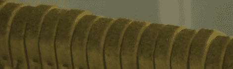

# 用碳纤维翻新旧钢琴

> 原文：<https://hackaday.com/2012/07/30/refurbing-an-old-piano-with-carbon-fiber/>

[克里斯]拿起一个小钢琴。当然，对于一个由木头制成的复杂机械装置来说，它并不是处于最佳状态。他正在尽最大努力翻新这架价值 350 美元的钢琴，并把它变成一架价值 20 万美元的音乐会钢琴

[克里斯]花 350 美元买的 1941 年金博尔婴儿三角钢琴送到他家时完全是一塌糊涂。清理木头并更换一些毛毡后，钢琴看起来好多了，但[克里斯]想让它演奏得更好。

从一辆 1909 年的施坦威车上拿起一套锤子后，[克里斯]拆开了他的 Kimball。斯坦威琴锤被从琴柄上取下，碳纤维琴柄被粘在合适的位置，整个组件被放回钢琴中。

有了新的毛毡，新的琴槌，每个键上都有重量轻的琴柄，[克里斯]有了一架非凡的钢琴，它很可能比新的还要好。对于一架 350 美元的钢琴来说，这是一个不错的结果。

你可以看看[Chris]的“休息后制作视频”以及休息后的一小段[Mozart](我们认为)。

[https://www.youtube.com/embed/6fyiPNAcVfw?version=3&rel=1&showsearch=0&showinfo=1&iv_load_policy=1&fs=1&hl=en-US&autohide=2&wmode=transparent](https://www.youtube.com/embed/6fyiPNAcVfw?version=3&rel=1&showsearch=0&showinfo=1&iv_load_policy=1&fs=1&hl=en-US&autohide=2&wmode=transparent)