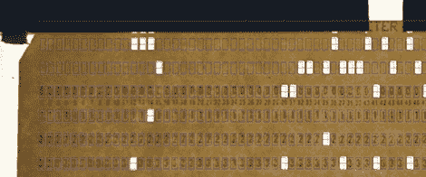

# 用 Arduino 和数码相机读取穿孔卡

> 原文：<https://hackaday.com/2012/07/30/reading-punch-cards-with-an-arduino-and-digital-camera/>

[digitaltrails]想要他放在周围的一些旧的 IBM 80 列穿孔卡上的数据，但他的车库中没有几十年的旧计算机硬件。他决定用乐高、一台 Arduino、一台数码相机和一点 Python 语言来建造自己的 T1。

[digital traits]构建的[硬件部分](http://codeincluded.blogspot.co.nz/2012/07/punch-card-reader-hardware.html)包括一个完全由乐高积木制成的曲柄操作进给机构。曲柄每转一圈，进给机构就会将一张卡片送入滑槽，在滑槽中，连接到阿尔杜伊诺的光电探测器会告诉相机拍照。之后，伺服系统被激活，将卡片发送到“已扫描”箱中。

在构建的[软件端，【digitatrails】使用](http://codeincluded.blogspot.co.nz/2012/07/punchcard-reader-software.html) [Python 图像库](http://www.pythonware.com/products/pil/)扫描每列预期所在的一行像素。该软件输出包含在 80 列卡片上的代码和数据，以及每张卡片非常酷的 ASCII 艺术版本。

考虑到你不能去 Fry's 买一个 IBM 80 列穿孔读卡器，我们喜欢[digitatrails]从一个不可读的存储介质中获取数据的聪明方法。休息之后，请观看读卡器的运行视频。

[https://www.youtube.com/embed/LcwxW2ne-UU?version=3&rel=1&showsearch=0&showinfo=1&iv_load_policy=1&fs=1&hl=en-US&autohide=2&wmode=transparent](https://www.youtube.com/embed/LcwxW2ne-UU?version=3&rel=1&showsearch=0&showinfo=1&iv_load_policy=1&fs=1&hl=en-US&autohide=2&wmode=transparent)