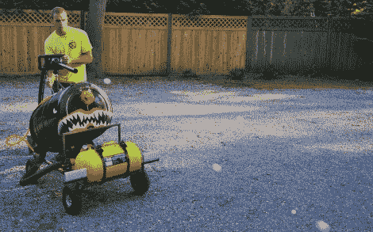

# 乒乓球弹幕

> 原文：<https://hackaday.com/2012/07/30/ping-pong-ball-barrage/>

在麻省理工学院，大二和大三之间的休息时间你应该做什么？你最好造些牛逼的东西。[克里斯蒂安·里德]没有让他的最新作品失望。他称之为“乒乓猛兽”,我们认为这是一个恰当的名字。它不只是午餐球，它喷出无情的弹幕。

他肯定不缺弹药。几个装满白色球体的垃圾袋至少有 3000 个，而他用作漏斗的塑料桶有足够的空间容纳它们。堵塞是一个问题，在上图中，你可以看到他用右手操作搅拌器，以防止堵塞。该系统是可移动的，但用于推动球的车间真空需要交流电。这意味着有一条绳索阻止它离家太远。[克里斯蒂安]在设计中包括一个空气罐，但显然压缩空气对发射速度没有太大帮助。这很好，因为[增压球枪可能会很吓人](http://hackaday.com/2009/11/02/ping-pong-launcher-your-wife-cant-know-about/)。

休息后，请观看视频，观看乒乓球飞行。我们打赌，至少在今年夏天剩下的时间里，他们会在院子里给一些流浪狗割草。

[https://www.youtube.com/embed/7ZkZcu5xo1w?version=3&rel=1&showsearch=0&showinfo=1&iv_load_policy=1&fs=1&hl=en-US&autohide=2&wmode=transparent](https://www.youtube.com/embed/7ZkZcu5xo1w?version=3&rel=1&showsearch=0&showinfo=1&iv_load_policy=1&fs=1&hl=en-US&autohide=2&wmode=transparent)

[谢谢内拉]