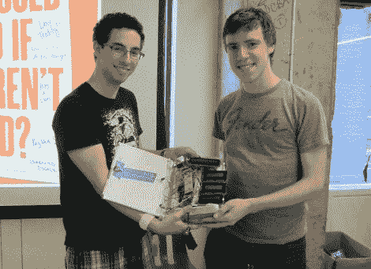

# 脸书书中的黑客马拉松结果

> 原文：<https://hackaday.com/2012/07/30/hackathon-results-in-the-facebook-book/>

[Jeremy Blum]和[Jason Wright]在 24 小时黑客马拉松结束时展示他们的项目。脸书总部在纽约市举行了这次活动，作为他们的黑客夏季计划的一部分。作为对东道主的敬意，黑客二人组决定[制作一本实体书，并用虚拟脸书](http://www.jeremyblum.com/portfolio/face-book-squared/)填充其中。你把这样的创造叫做什么？Face(book)^2.

休息后的视频给出了硬件的最佳概述，但这里是它的要点:他们从他们能找到的最大的精装书开始，挖空它的页面来容纳他们自己的硬件。当你打开这本书时，它会通过 Xbee 链接向电脑回拨数据请求。电脑上的 python 脚本从脸书订阅源中提取最新内容，将其发送回图书进行显示。为此，内置了一个图形液晶显示器和四个字符液晶显示器。还有一个加速度计，用于检测封面受到挤压时的翻页情况。其余的交互性由安装在较小的 LCD 屏幕旁边的几个触摸开关提供，用于导航和“类似”功能。

[https://www.youtube.com/embed/ssjK78L1oas?version=3&rel=1&showsearch=0&showinfo=1&iv_load_policy=1&fs=1&hl=en-US&autohide=2&wmode=transparent](https://www.youtube.com/embed/ssjK78L1oas?version=3&rel=1&showsearch=0&showinfo=1&iv_load_policy=1&fs=1&hl=en-US&autohide=2&wmode=transparent)