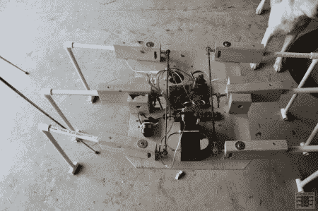

# 由木头和 PVC 管制成的大型六足动物

> 原文：<https://hackaday.com/2012/07/31/a-large-hexapod-made-of-wood-and-pvc-pipe/>

虽然无论如何它都不是我们见过的最大的六足步行机，但它还是值得一提。它由挡风玻璃刮水器电机、PVC 管和大量木材制成，仍然是一个很大的机器人。这是一项正在进行中的工作，但看看它的腿正在测试的视频，以及休息后它的一个初步组装。

控制类似于[这个小六足动物](http://www.jcopro.net/2010/12/04/the-evolution-of-pegleg-the-six-legged-hexapod-robot/ "pegleg the six-legged robot")我们之前介绍过的的前腿和后腿由一个马达驱动，并用螺纹杆连接在一起。不过在这种情况下，杆是 1/4-20，比它的小前身使用的 4-40 杆大得多。也不像小短腿，中间的腿是独立驱动的，不是连在一起的。这应该考虑到一些不同的运动模式。

不同的运动模式，如果它能走路的话。虽然能够自己站起来，但中间的腿几乎不足以支撑大型电池和强大但沉重的汽车发动机。这是这个项目的一个介绍性帖子，一切都有望及时得到解决和解释。一定要回来看看这个机器人是如何进步的，以及这个“机器人”不同元素的细节。

[https://www.youtube.com/embed/6gZnngMo29g?version=3&rel=1&showsearch=0&showinfo=1&iv_load_policy=1&fs=1&hl=en-US&autohide=2&wmode=transparent](https://www.youtube.com/embed/6gZnngMo29g?version=3&rel=1&showsearch=0&showinfo=1&iv_load_policy=1&fs=1&hl=en-US&autohide=2&wmode=transparent) [https://www.youtube.com/embed/NFXKD_RlyxQ?version=3&rel=1&showsearch=0&showinfo=1&iv_load_policy=1&fs=1&hl=en-US&autohide=2&wmode=transparent](https://www.youtube.com/embed/NFXKD_RlyxQ?version=3&rel=1&showsearch=0&showinfo=1&iv_load_policy=1&fs=1&hl=en-US&autohide=2&wmode=transparent)

特别感谢狗[Evie]在照片中与 RC walker 合影！