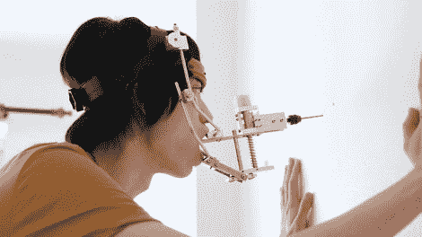

# 让你的牙医畏缩的口腔动力工具

> 原文：<https://hackaday.com/2012/07/31/mouth-powered-tools-that-will-make-your-dentist-cringe/>

想试试你的运气，用这个口钻钻出 PCB 吗？[郭城]展示了他众多嘴部动力工具中的一个。这是一个微小的钻头，随着你下巴的开合而旋转。这个概念可能看起来有点傻，但他制造这些机器的能力是惊人的。

休息后的片段从上面看到的钻孔演示开始。在那里，他展示了几种不同的工具。一种是成型机，利用你的呼吸来旋转模具，从而迫使里面的材料符合它的形状。还有一台木工车床。你把切割工具含在嘴里，用弓和弦来旋转机械装置。如果你很擅长吮吸，他的真空吸尘器模型很合你的胃口。把塑料原料放在微波炉里加热，然后使劲吸。最后，他展示了一台挤压机。我们不太清楚那个是如何工作的。

[https://player.vimeo.com/video/44281343](https://player.vimeo.com/video/44281343)

[通过[使](http://blog.makezine.com/2012/07/26/mouth-powered-tools/)