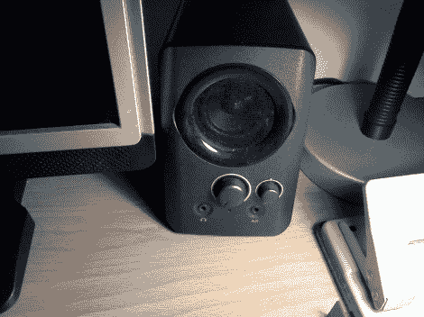

# 返工电子产品以获得更好的计算机扬声器音频

> 原文：<https://hackaday.com/2012/07/31/reworking-the-electronics-for-better-computer-speaker-audio/>

[陈赫]喜欢他从这些海盗船 SP2200 电脑扬声器中得到的声音，有一个很大的例外。他们发出一些令人不快的噼啪声。他认为这可能就像更换一个有故障的电位计一样简单，但很快发现修复要比这复杂得多。该说的都说了，该做的都做了[他最终修改了扬声器放大器板的设计](http://www.instructables.com/id/Fixing-Corsair-SP2200-Crackling/)。

最困难的部分是识别问题。他打开箱子后，用万用表测试发现音量电位计工作正常。接下来，他检查了电路板的不良焊点，但并没有发现任何不良焊点。当他意识到使用耳机时也会出现爆裂声时，突破就来了。有了这个发现，他开始做更多的观察，并意识到当音量旋钮完全调高或完全调低时，噼啪声不会发生。电位计和放大器电路之间存在阻抗问题。他改变了电路板上的信号流，将耳机放大器用作滤波器，从而解决了这个问题。相应地，他把这个项目加入了[Instructables Fix&改进竞赛](http://www.instructables.com/contest/fixit2012/)。