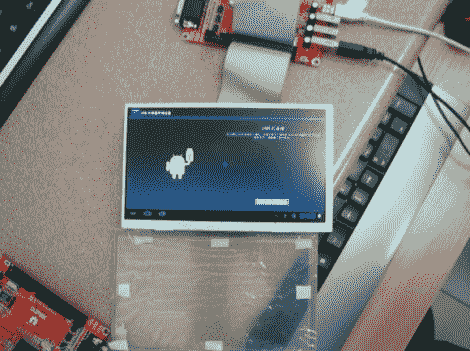

# OLinuXino 引导 Android

> 原文：<https://hackaday.com/2012/08/01/olinuxino-booting-android/>

我们不能说这个名字是脱口而出的，但它开始看起来像是即将发生的事情。在这里你可以看到[的原型硬件引导 Android](http://olimex.wordpress.com/2012/07/31/a13-olinuxino-first-time-android-boot/) 。如果这是你第一次看到这种硬件，你可以把它和树莓派归为一类。这是一个踢屁股手臂平台，作为一个裸板，你可以做你喜欢的事情。

Olimex Ltd .将该产品放在一起，这似乎是名称 mash-up 的一部分(Olimex + Linux + Arduino？).该板承载一个运行频率为 1 GHz 的 ARM Cortex-A8 处理器。有一个半千兆字节的内存，四个 USB 和一个 USB OTG 端口，以及一个大阵列的突破引脚。一个令人惊讶的选择是不包括 HDMI 连接器。相反，该板提供 VGA 和音频输出。如上图所示，有一个用于 LCD 屏幕的引脚接头，因此可能是为了更小或更便携的应用。但正如我们所说，外形确实让您可以随心所欲。

可能最好的部分是价格。这款顶级主板的目标价格为 55 欧元(约 68 美元)，配有 WiFi 和 4gb NAND 存储。这个项目上有很多帖子，包括对 PCB 布线工作的观察。到 A13 标签的这个链接会给你到目前为止最广泛的作品概述。

[感谢访问]