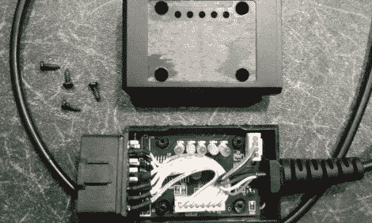

# 黑进一辆福特福克斯 Mk2 的电脑界面

> 原文：<https://hackaday.com/2012/08/01/hacking-the-computer-interface-of-a-ford-focus-mk2/>

你可以对你的福特福克斯 Mk2 的工作方式做一些巧妙的事情，但首先你必须获得数据系统的访问权。如果你懂一些俄语，并且不介意电子狗重新布线，这本指南会让你立刻黑进汽车的 CAN 总线。它是由[Preee]编写的，他已经在速度计显示面板上添加了无线电 RDS 和 CD 曲目信息，实现了手机的免提控制，禁用了倒车时汽车发出的声音，将门锁速度从 5 英里/小时改为 10 英里/小时，等等。

要访问该系统，您需要硬件来连接计算机和 CAN 总线。他找到易贝，买了一根 ELM327 电缆，插入车载诊断端口(ODBII)。有两种不同的方式可以配置这些加密狗，因为这不是一个正确的焦点，他必须改变它。他的硬件变化在论坛跟帖的第二个帖子里有说明。他没有切换到另一种配置，而是连接了一个拨动开关在两者之间进行选择。

硬件到位后，他抓起一些软件，开始破解。但是正如我们上面暗示的，这并不像你想象的那么简单。软件是俄语的。[Preee]尽了最大努力给一些截图添加了翻译，但是在 GUI 上找到自己的路还是有点麻烦。

[谢谢弗雷德]