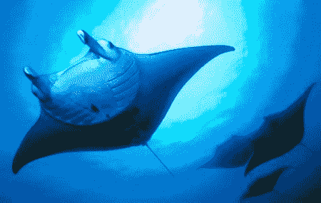

# 机器人蝠鲼(蝠鲼)

> 原文：<https://hackaday.com/2012/08/03/robotic-manta-ray-mantabot/>

由[生物启发工程研究实验室(比尔实验室](http://www.bartsmithlabs.com/bier/index.html))创造的代号为 MantaBot 的机器人蝠鲼即将引起轰动。水下机器人的下一次进化就在这里。我们已经看到了像机器鱼和水母这样的鱼，现在要加入学校的是蝠鲼，它被设计成模仿蝠鲼独特的游泳动作，

这种受生物启发的水下机器人的主要目标是利用其机载电子设备自主决定在水域中的航行。比尔实验室获得了国防部多学科大学研究计划(MURI)的大量资助。从长远来看，它的部分目标是对这些生物的生物系统进行逆向工程，以创造模拟的人造皮肤和肌肉。

[Via[dvice.com](http://dvice.com/archives/2012/07/underwater-robo.php "dvice underwater manta ray robot")

[https://www.youtube.com/embed/n66N7Xkxazc?version=3&rel=1&showsearch=0&showinfo=1&iv_load_policy=1&fs=1&hl=en-US&autohide=2&wmode=transparent](https://www.youtube.com/embed/n66N7Xkxazc?version=3&rel=1&showsearch=0&showinfo=1&iv_load_policy=1&fs=1&hl=en-US&autohide=2&wmode=transparent)