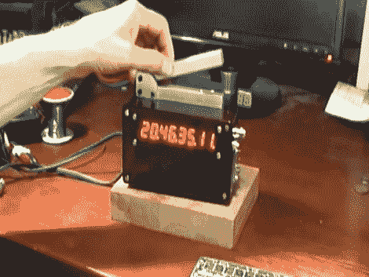

# 原子拍板板

> 原文：<https://hackaday.com/2012/08/02/atomic-clapperboard/>

无论你知道它是快板，石板，石板，时间板，还是其他名称，你可能会认识到这种电影制作的主食。这是一种方便的方法，有助于同步声音和视频，并在编辑时跟踪剪辑。但是[这个拍板比大多数](http://babynetslate.wordpress.com/2012/07/30/main/)要精确得多。它有一个精确的原子钟源。

该项目来自易贝上铷时钟源模块的不断增长的可用性。它们的价格不到 100 美元，你将享受到 0.1 ppm 的精度。[Luddite Tech]为自己抓了一个并包含在这个版本中。正如您在中断后的片段中看到的那样，八位数显示的对比度是可调的，并且在吸附标记时最亮。我们猜测他在演示开始时连接的电缆是用来设置初始时间基准的。之后，内置 WiFi 可以用于将时间标记推送到计算机上。

[https://www.youtube.com/embed/KoF-6_l2Qlk?version=3&rel=1&showsearch=0&showinfo=1&iv_load_policy=1&fs=1&hl=en-US&autohide=2&wmode=transparent](https://www.youtube.com/embed/KoF-6_l2Qlk?version=3&rel=1&showsearch=0&showinfo=1&iv_load_policy=1&fs=1&hl=en-US&autohide=2&wmode=transparent)

[谢谢凯文]