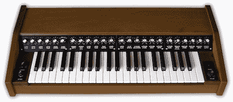

# 将旧键盘变成艺术品

> 原文：<https://hackaday.com/2012/08/05/turning-an-old-keyboard-into-a-work-of-art/>

20 世纪 70 年代是模拟合成器的光辉岁月，对[Stefan]来说，听巨大的模块化 Moogs 和 ARP 导致了一种奇妙的沸腾嫉妒。2009 年，想要重温童年的一点点时光，[Stefan]从易贝拿起了一件 PAiA Stringz'n'Things。这是一个很棒的小键盘，但[Stefan]他新买的东西看起来比一个 tolex 覆盖的飞行包稍微高级一点。在摆脱了旧的 tolex 外壳后，[Stefan] [做了一个新的外壳](http://www.stefanv.com/electronics/paia_stringz_n_thingz.html)，并添加了一些额外的电路来扩展这个经典合成器的功能。

在更换了电解电容器并解决了电压调节器的问题后，[Stefan]用漂亮的涂漆桃花心木为他的键盘做了一个新的外壳。从旧雅马哈风琴偷来的新琴键床被带了进来，琴键上方的新控制面板提供了比键盘的前代产品更合理的组织。

最初的弦乐的布局更像是一个风琴，而不是一个合成器，这反映了它的复调性质。这意味着没有非常多样化的调板，但[Stefan]用波形折叠器来产生额外的谐波，颤音和包络发生器来为每个音符提供起音和衰减，从而弥补了这一点。

现在[Stefan]有了一个可爱的复音合成器，它在一个旧的 Hammond 风琴上找到了自己的位置。作为奖励，合成器听起来真的很棒。对于一个被普遍认为非常有限的乐器来说，这已经不错了。【T2