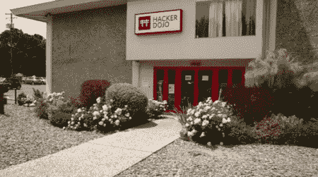

# [黑客道场]革新 Kickstarter

> 原文：<https://hackaday.com/2012/08/07/hacker-dojo-renovations-kickstarter/>

[【黑客道场】](http://www.hackerdojo.com/ "Hacker Dojo")，正如你可能已经怀疑的那样，是一个总部设在加州的黑客空间，它希望你的钱能帮助它进行翻新。当然，地面上有一点灰尘没什么不对，但这个空间的一半显然被认为不适合其成员黑客使用。为此，他们正在 [Kickstarter 上开展一项活动](http://www.kickstarter.com/projects/384590180/an-events-space-and-a-design-studio-for-hacker-doj?ref=card "Hacker Dojo Kickstarter")，为翻修筹集 25 万美元。如果这对你来说似乎有点高，请记住，以大多数标准来看，这似乎是一个相当大的空间，而且该地区的土地价格并不便宜。

如果你没那么大方，(谁能抵挡住他们 Kickstarter 上 0:35 左右视频里那些悲伤的面孔？)他们还提供一些甜蜜的奖品。不幸的是，原创者 Al Alcorn 签名的原始超级 Pong 机器已经售出，但只需 2 美元，你就可以得到他们永远的感谢！对于更实在的东西，他们有 8 美元的贴纸，32 美元的衬衫，以及其他高达 10，000 美元的奖品，奖励最昂贵的壁画上的“创造性投入”。