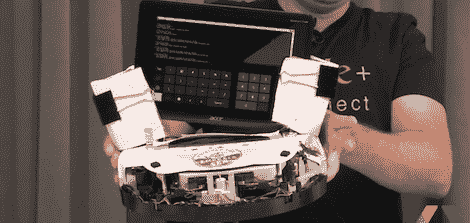

# 见见奥斯卡，谷歌闲逛机器人

> 原文：<https://hackaday.com/2012/08/07/meet-oscar-the-google-hangout-robot/>

[Gus]来到 Google+开发者 vlog 展示他的新 [Google+ hangout 控制的机器人](https://www.youtube.com/watch?v=Bx1R5ObX2Zw&feature=plcp)。这个机器人被命名为 OSCAR(过度简化的协作驱动机器人)，在 Google+ hangout 中根据每个人的奇思妙想四处行驶。这个机器人不仅可以通过 Google+ hangout 远程控制，它还配有摄像头，允许经常出没的观众实时探索空间。

[Gus]用他在父母地下室找到的旧 Roomba 做了 OSCAR。在用一些活页夹将一个 Android 平板电脑连接到 Roomba 后，[Gus] [在平板电脑上安装了一个网络服务器，并编写了一个 Google+ hangout 扩展](http://gusclass.com/blog/2012/07/31/oscar-the-hangout-robot/)，允许所有 hangout 观众远程控制奥斯卡。

现在，在 hangout 上收到的所有命令都被放入一个队列中，这意味着 hangout 上的每个人都可以控制 OSCAR。下一个版本将把这些命令改变为增量，或者改变当前状态，取消冲突的命令。如果我们在观看红牛比赛时有一台这样的设备就好了

休息之后你可以看看奥斯卡的演示。

[https://www.youtube.com/embed/HCxQZDSk2bc?version=3&rel=1&showsearch=0&showinfo=1&iv_load_policy=1&fs=1&hl=en-US&autohide=2&wmode=transparent](https://www.youtube.com/embed/HCxQZDSk2bc?version=3&rel=1&showsearch=0&showinfo=1&iv_load_policy=1&fs=1&hl=en-US&autohide=2&wmode=transparent)