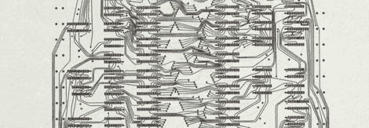

# 用逻辑芯片计算机模拟天气模式

> 原文：<https://hackaday.com/2012/08/07/retrotechtacular-simulating-weather-patterns-with-a-logic-chip-computer/>

1975 年，伊利诺伊大学厄巴纳-香槟分校的计算机科学教授[D. L. Slotnick]面临一个问题:气象学家收集的数据比目前的天气模拟所能处理的要多得多。[斯洛特尼克]的解决方案是建造一台更快的计算机来运行这些大气环流模拟。唯一的问题是计算机需要快速廉价地制造，这意味着使用现成的硬件，在 1975 年这意味着 TTL 逻辑芯片。[Ivan]找到了这个项目的技术报告(一个巨大的 PDF，你已经被警告了)，我们对这台新电脑的规模感到敬畏。

对这台计算机的一个要求是，它的计算能力大约是戈达德空间研究所从事同样大气计算任务的 IBM 360/95 的 100 倍。此外，计算机需要能够用用于大气研究的类似 FORTRAN 的“高级”语言编程。

结果——不要忽视设计这台机器的惊人工作量——是一台由 210，000 个独立逻辑芯片组成的计算机，总成本为 270 万美元，按 2012 年的美元计算约为 1000 万美元。这台计算机的功耗将是疯狂的——大约 90 千瓦，或足以为 24 个美国家庭供电。 ****

如果这台电脑真的是*制造的*的话，我们找不到多少信息，但是所有的工作都在报告中，准备好让任何一个得到适当资助的机构用逻辑芯片制造一台功能惊人的电脑。