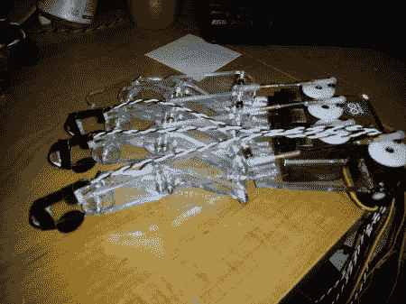

# 具有触觉反馈的机器人手

> 原文：<https://hackaday.com/2012/08/09/robotic-hand-with-haptic-feedback/>

当我在亚利桑那州梅萨市的 Heatsync 实验室时，[Nate]提到他真的为帮助别人制造机器人手而感到自豪。我已经找到了那个项目，因为它看起来很酷。

[Macguyver603] [制造了这只机械手，它由一只带有柔性传感器的手套控制](http://www.instructables.com/id/How-to-Build-a-Robotic-Hand-with-Haptic-Feedback/)。他原本打算 3d 打印手的结构，但激光切割机的出现让他能够创造出结构更合理的东西。触觉反馈由振动的寻呼机电机提供，该电机由机器人手指尖的传感器触发。

该项目的总成本约为 240 美元，不幸的是没有视频。然而，这确实为他赢得了州博览会的第二名！