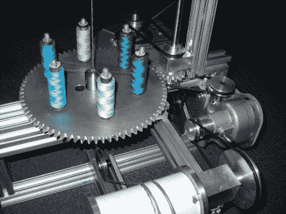

# 保险丝制造机

> 原文：<https://hackaday.com/2012/08/10/fuse-making-machine/>

这是一台保险丝制造机,操作起来几乎和工厂机器一样好。你弄清楚这到底是什么了吗？这不是电保险丝，这是粘性保险丝。还不完全清楚吗？别担心，我们也查过了。 [Visco 保险丝](http://en.wikipedia.org/wiki/Visco_fuse)是一种用于烟花的优质安全保险丝。

[罗伯特·麦克马伦]制造了这台机器，作为他在奥林学院获得机械工程学位的一部分。但在它的起源背后有一个爱好扭曲。当他有空的时候，他会参加奥林的消防艺术俱乐部，我们相信这些东西会派上用场。引信是通过将一股火药装入一根编织线制成的。二十线轴缠绕在一个细漏斗的喷嘴上。一旦外壳安装到位，机器就会给它涂上一层防水漆。

上图只显示了机器的底座。所有有趣的部分(和测试烧伤包括一个水下)可以在休息后的视频中看到。

[https://www.youtube.com/embed/E9X60KW60bg?version=3&rel=1&showsearch=0&showinfo=1&iv_load_policy=1&fs=1&hl=en-US&autohide=2&wmode=transparent](https://www.youtube.com/embed/E9X60KW60bg?version=3&rel=1&showsearch=0&showinfo=1&iv_load_policy=1&fs=1&hl=en-US&autohide=2&wmode=transparent)