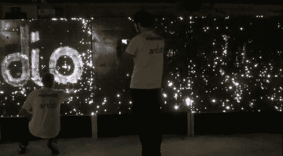

# 以水为墨水，用灯光粉刷墙壁

> 原文：<https://hackaday.com/2012/08/12/painting-a-wall-with-light-using-water-as-ink/>

这个艺术装置运用了一个奇妙的概念。可以用水作为墨水来粉刷墙壁，点亮一个巨大的白色 led 网格。这提供了一个非常广泛的互动可能性，因为水可以应用于许多方面。拿起画笔，弄湿手指，使用水枪，或者用喷雾瓶喷雾，灯光会告诉你你撞到了哪里。

我们希望一位既会说法语又会说英语的读者可以帮忙，在原型制作视频上发布一个翻译作为评论。在这篇文章中，[Antonin Fourneau]展示了最终产品的各种原型，我们很想知道他在说什么。但通过观看原型，然后在休息后观看英语宣传片，我们可以做出很好的猜测。电路板上有一个孔，完全适合平板透镜 led。这就形成了一个几乎不透水的密封，使液体保持在一侧，而导线在另一侧是安全的。水侧有弯曲的垫，允许水滴完成电连接。

[https://player.vimeo.com/video/47095462](https://player.vimeo.com/video/47095462)

[谢谢杰克]