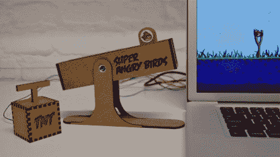

# 超级愤怒的小鸟是游戏的物理控制器

> 原文：<https://hackaday.com/2012/08/12/super-angry-birds-is-a-physical-controller-for-the-game/>

这种角色互换还是蛮有娱乐性的。虽然游戏《愤怒的小鸟》是用弹弓打翻东西的虚拟实现，但《超级愤怒的小鸟》在虚拟游戏中加入了物理控制元素。这很傻，但执行得很好。主控制器利用了一个我们不常使用的部分。这是一种电动线性致动器，最常见于高端音频控制台。

休息之后，请观看视频，了解控制器的运行情况。线性编码器用于模拟拉回橡胶吊索。它使用电动功能弹回原位，但我们不确定马达在拉动过程中是否也提供阻力。激光切割盒还包括一个 TNT 触发盒形式的伴侣。

如果这对你来说不够真实[也许这个弹弓控制器就足够了](http://hackaday.com/2012/02/28/usb-slingshot-controller-is-for-the-birds/)。

[https://player.vimeo.com/video/46975682](https://player.vimeo.com/video/46975682)

[感谢马丁和许多其他人]