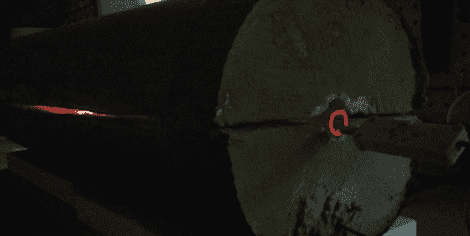

# 铜蒸气激光太神奇了

> 原文：<https://hackaday.com/2012/08/13/copper-vapor-laser-is-diy-awesomesauce/>

有什么比把氯化铜加热到 400 摄氏度，建造旋转火花隙和 30kV 电容器，玩高真空和建造非常强大的激光器更好的方式在车间度过几个月呢？这只是[乔恩]生命中的一天，他正在制作一台自己动手制作的铜蒸汽激光器。

[铜蒸汽激光器](http://en.wikipedia.org/wiki/Copper_vapor_laser)需要大约 1500°C 的温度，但这只是在使用纯铜的情况下。像氯化铜这样的化合物能够将产生激光所需的温度降低到 400 摄氏度左右，这对于乔恩自己建造的激光管炉来说是一个合理的温度。这种设置的唯一问题是需要两个电脉冲，一个用于分离铜，另一个用于使铜产生激光。

产生这些电脉冲的专业方法是闸流管，但似乎[乔恩]想要更酷的东西。他用两个 2 英寸厚的丙烯酸块制作了一个旋转火花隙，这使得他能够完美地计时激光所需的电脉冲的频率和间隔。

没有确切的消息说[乔恩]的铜蒸汽激光器在完成后会输出多少能量，但是[乔恩]的建造日志已经是一个令人惊叹的展示。休息之后，你可以看看一个展示[Jon]的激光器、火花隙和巨大的自制电容器的短片。

[https://www.youtube.com/embed/JeQPHVg2Bbg?version=3&rel=1&showsearch=0&showinfo=1&iv_load_policy=1&fs=1&hl=en-US&autohide=2&wmode=transparent](https://www.youtube.com/embed/JeQPHVg2Bbg?version=3&rel=1&showsearch=0&showinfo=1&iv_load_policy=1&fs=1&hl=en-US&autohide=2&wmode=transparent)