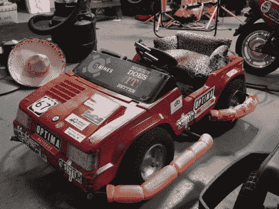

# Fauxrarri 是 PPPRS 冠军

> 原文：<https://hackaday.com/2012/08/13/fauxrarri-is-the-ppprs-champion/>

Power Racing Series (PPPRS)是一项电动汽车比赛，价格上限为 500 美元。这是 2012 年的冠军 Fauxarri。它是由威斯康星麦迪逊 67 区的成员建造的。让我们高兴的是，[他们公布了这东西是如何建造的。](http://www.sector67.org/blog/2012/fauxrarri/)

推进电动赛车背后的人不是第一次做这种事情了，这并不奇怪。他们中的一些人参与了威斯康星大学的混合动力方程式赛车。这种体验体现在作为 Arduino 防护罩构建的定制电机控制器中。它包括对加速率、油门响应和再生制动的控制。但是你不能只靠一个控制器。他们使用的马达是一些特殊的电动花园拖拉机马达，他们添加了自己的水冷系统。

如果你想好好看看这个东西有多快多强大，就去看看关于 PPPRS 的 KC 分支[的帖子吧(它拖着第二辆车，仍然超过了竞争对手)。](http://hackaday.com/2012/07/04/makerfaire-k-c-power-wheels-racing/)