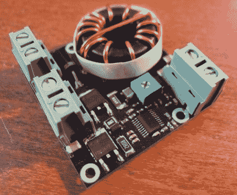

# 如何设计自己的 LED 驱动器

> 原文：<https://hackaday.com/2012/08/14/how-to-design-your-own-led-driver/>

如果你发现自己需要一个大功率 led 灯串的驱动程序，这是一本必读的书。[Limpkin]刚把这个驱动设计成合同工。他不能向我们展示原理图，但他分享了一些关于如何围绕 MAX16834 芯片构建 LED 驱动器的技巧。

当你转向更高的权力设计时，成功的障碍会很快堆积起来。使用 MAX16834 这样的芯片确实有助于简化任务，因为它可以用作升压或降压转换器，它包括调光功能，并且是一种恒流解决方案。这些设计中需要考虑电路板设计问题。[Limkin]包含一些计算器的链接，帮助您确定驱动器使用的基于走线宽度的功率水平。他还建议在通过过孔连接的电路板两侧使用铜浇注，以帮助散热。为此，他在测试过程中使用红外温度计进行反馈。

太糟糕了，他在工作中没有任何设备的照片。如果你建造了类似的东西，请拍些照片并[向我们透露一下](http://hackaday.com/contact-hack-a-day/)。