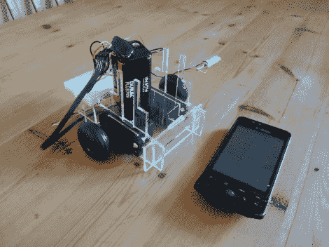

# 使用智能手机音频插孔的机器人伺服控制

> 原文：<https://hackaday.com/2012/08/14/robot-servo-control-using-smartphone-audio-jack/>

[Jim]有一部旧的 Android 手机，他想把它用作机器人大脑。它有很多你想在机器人平台上看到的东西；WiFi、蓝牙、摄像头、加速度计等。但是他需要一些方法来使移动，移动。他想出的是一个带有伺服系统的底盘，可以通过手机的音频端口控制。

为了开始他的冒险，他在 Audacity 中制作了一个方波音频文件，然后在 Android 音乐播放器上播放。通过监控示波器的输出，他发现产生的波形很好，峰值约为 1V。考虑到这一点，他设计了一个电路，使用两个晶体管来放大信号，从而为伺服电机创建一个可用的输入。每个电机都连接有这些电路中的一个，音频插孔的左右声道分别驱动它们。在休息后的剪辑中，你可以看到他甚至写了一个简单的 Android 应用程序，将这个想法扩展到一个更可用的水平。

这是我们大约一年前看到的侦察机器人使用的类似技术。

[https://www.youtube.com/embed/lIXjgXOrEsw?version=3&rel=1&showsearch=0&showinfo=1&iv_load_policy=1&fs=1&hl=en-US&autohide=2&wmode=transparent](https://www.youtube.com/embed/lIXjgXOrEsw?version=3&rel=1&showsearch=0&showinfo=1&iv_load_policy=1&fs=1&hl=en-US&autohide=2&wmode=transparent)