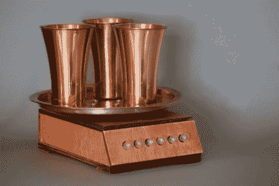

# 牙刷定时器

> 原文：<https://hackaday.com/2012/08/15/toothbrush-timer/>

这个牙刷架将确保你刷牙的时间长度合适。这三个杯子用作 tootbrush 存储空间，并在其中一个杯子被移除时进行检测。一旦你开始刷牙，前面的灯和后面的铃会自动倒计时。

当底座中的重量传感器检测到由拿起牙刷引起的变化时，计数序列开始。atmega 328——用 Arduino 风格的代码编程——然后打开安装在底座前部的所有白炽灯。每个开关都由 2N3904 晶体管控制，以便为灯泡吸收足够的电流。随着两分钟计时器的减少，灯泡一个接一个地熄灭。但也有听觉反馈机制。底座的背面是一个小铃铛。伺服系统上的锤子每 30 秒钟敲一次钟，让你知道你做得怎么样。整个系统由内部锂离子电池驱动，充电间隔约为三周。不要错过休息后找到的演示视频。