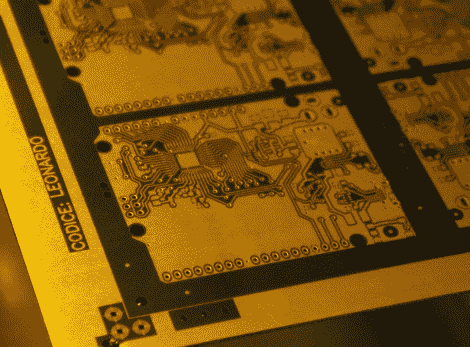

# Arduino 的诞生

> 原文：<https://hackaday.com/2012/08/15/birth-of-an-arduino/>

嘿，看，一个没穿衣服的 Arduino。这只是开始了它成为无处不在的原型工具的旅程。这张图片来自[Bunnie]最近的[参观制造 Arduino 板的工厂](http://www.bunniestudios.com/blog/?p=2407)。

正如每块真正的 Arduino 板上所写的，它们是意大利制造的。[邦尼的]工厂之旅发生在都灵郊区的斯卡马格诺。该工艺从大块 FR4 覆铜材料开始，通常尺寸约为 1×1.5 米。第一项任务是将板材送进数控钻床。所有的孔都做好了，是时候做一些蚀刻保护层了；上面的图像是刚刚在抗蚀剂已被应用。一个机器人系统从这里接手，让面板通过化学物质，首先蚀刻掉铜，然后去除抗蚀剂并镀上剩余的痕迹。从那里，它被送到另一台机器上进行阻焊和丝网印刷。

每个步骤都有视频。但我们最喜欢的部分是结尾的图像，显示了一个托盘，上面堆放着完成的 PCB 板，这些板将被用于组装元件。

[via [Reddit](http://www.reddit.com/r/arduino/comments/y6xw7/where_arduinos_are_born_touring_a_pcb_factory/)