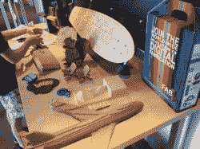
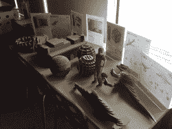
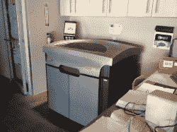
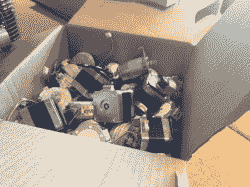
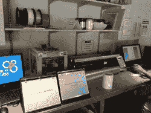
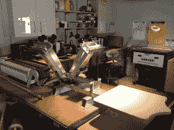
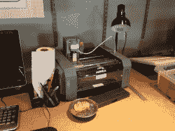
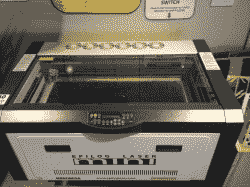

# 西南之旅:俄克拉荷马州塔尔萨的私人实验室

> 原文：<https://hackaday.com/2012/08/15/southwest-tour-fablab-in-tulsa-oklahoma/>

[https://www.youtube.com/embed/xLiH8l6hxlQ?version=3&rel=1&showsearch=0&showinfo=1&iv_load_policy=1&fs=1&hl=en-US&autohide=2&wmode=transparent](https://www.youtube.com/embed/xLiH8l6hxlQ?version=3&rel=1&showsearch=0&showinfo=1&iv_load_policy=1&fs=1&hl=en-US&autohide=2&wmode=transparent)

我们旅行的第一天经过了俄克拉何马州的塔尔萨，但当时是凌晨，所以我们跳过了私人实验室。然而在回家的路上，这个时间是快速参观的最佳时机。[Blixa]很高兴带我参观并解释私人实验室是如何工作的。

我从来没有去过私人实验室，所以我很好奇它会是什么样子。私人实验室与你的标准黑客空间略有不同，有一套他们必须遵守的结构，被认为是私人实验室，有点像特许经营。你不是付钱成为会员，而是为机器上的时间付费。从我在塔尔萨私人实验室看到的情况来看，这种模式似乎运行良好。他们有非常好的设备，游客似乎一直在使用。

就像黑客空间一样，当地团体也会聚集在那里。正如[Blixa]在视频中指出的那样，[塔尔萨 Webdevs](http://www.tulsawebdevs.org/) 和[塔尔萨开源硬件](http://tosh.wikia.org/)团队最近在那里会面。

