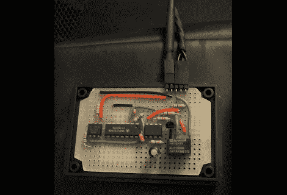

# 通过电视自动控制扬声器

> 原文：<https://hackaday.com/2012/08/15/automatic-speaker-control-via-tv/>

[Jon]想让他的扬声器随着他的电视开关。如果开着，扬声器会发热，所以他不想那样做。但是切断电源也会重置音量(这是一套旧的 PC 扬声器，遥控器是有线的，不是红外的)，所以使用开关电源插线板也是不行的。他想了一会儿，想试着用电视上的电源 LED 来构建自己的电路，这时他恍然大悟。可以[监控电视上的 USB 端口，并使用它来打开扬声器](http://jondontdoit.blogspot.ca/2012/07/turn-on-devices-with-your-tv.html)。

上面的电路使用了几个光隔离器来保护电视和扬声器。电视背面 USB 端口的 5V 线路由 XNOR 门监控(这有助于滤除开机时的一些切换)。当那扇门锁上时，它会启动一个 555 定时器，这个定时器又会启动扬声器。假设断电时也会发生这种情况，但我们会让您自己处理电路逻辑。