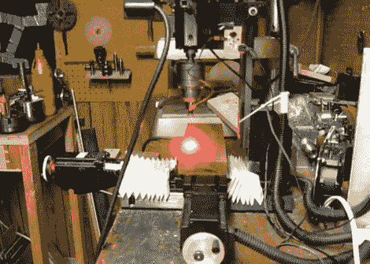

# 用于数控铣床的激光二极管控制器

> 原文：<https://hackaday.com/2012/08/15/laser-diode-controller-for-a-cnc-mill/>

[闻起来像自行车]想把激光蚀刻添加到他的家用 CNC 设置能够实现的技巧列表中。他有一个二极管可以完成这项任务，但他需要一个可以与 CNC 系统接口的驱动器。他最终设计了一个基于 LM3402 芯片的驱动板。

现在驱动一个激光二极管和驱动一个发光二极管没什么不同。他选择使用 LM3402 芯片，因为他是为该器件设计官方评估板的 TI 工程师。这意味着高功率 LED 应用，激光需要的 700 马和在规格范围内。由于他是手工焊接，并且这部分在底部有一个接地垫，他详细分享了他的焊接技术。一旦驱动器板准备就绪，他就使用“sed”命令，用数字开/关命令替换 g 代码 Z 轴命令，以切换二极管。

休息后请观看演示视频。他使用漫射光束，因为切割光束的亮度足以损坏他的相机。