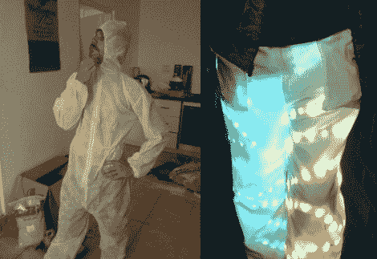

# 打造 LED 套装

> 原文：<https://hackaday.com/2012/08/16/building-an-led-suit/>

[Rob]一直在努力设计和制作这款 LED 套装，他可以穿着它去参加聚会。他让它工作了，虽然现在它只是一条裤子。它对声音做出反应，并有可能通过蓝牙从智能手机上进行控制。休息之后，你会看到一段视频描述。

规划从[为 led](http://rambo.co.za/?p=275)选择驱动硬件开始。[Rob]想让衣服随着房间里的音乐跳动，所以他拿了一个 MSGEQ7 芯片。当连接到麦克风和运算放大器时，该芯片将输出一个信号，可用作 VU 计。他将硬件构建到 Arduino 防护罩中，然后开始开发 LED 驱动板。他用的是 LED 灯条，但它们不是单独可寻址的。取而代之的是，他在穿戴者的腿上割了一些圈。每个环路连接 TLC5947 LED 驱动器芯片的引脚，该芯片吸收恒定电流并提供 PWM 功能。他在高端使用 PNP 晶体管。

对于任何曾经穿着特卫强西装工作过的人来说，在你知道他们不会呼吸之前。汗水会从你身上流下来。我们敢打赌，这就是在最近的一次聚会上导致短路烧伤[Rob]腿后部的原因。话说回来，[你的亮色皮条客外套](http://hackaday.com/2010/09/30/dazzling-coat-sure-to-be-in-demand-with-pimps-everywhere/)穿起来也会很热。

[https://www.youtube.com/embed/A5j4ItFvgrQ?version=3&rel=1&showsearch=0&showinfo=1&iv_load_policy=1&fs=1&hl=en-US&autohide=2&wmode=transparent](https://www.youtube.com/embed/A5j4ItFvgrQ?version=3&rel=1&showsearch=0&showinfo=1&iv_load_policy=1&fs=1&hl=en-US&autohide=2&wmode=transparent)