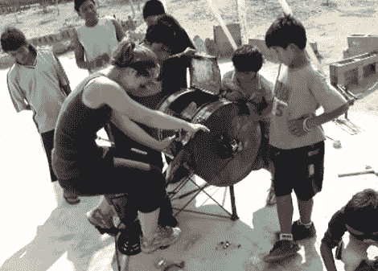

# 不用电就能洗的洗衣机

> 原文：<https://hackaday.com/2012/08/16/washing-machines-that-do-it-without-electricity/>

我们这些生活在第一世界的人认为干净的衣服是理所当然的。把它们扔进洗衣机，45 分钟后转移到烘干机里，再过两个星期左右就没有味道了。但是对于生活在没有电的地区的人们来说，干净的衣服是一个巨大的工作量。手洗一家人的衣服估计每天 6 小时，每周 3 到 5 天。这里有一个帖子，介绍了一些不同的人力洗衣机。

在使用一个五加仑的桶之前，我们已经建造了自己的人力机器，桶的底部有一个洞，可以容纳马桶活塞的手柄，充当搅拌器。但与这里看到的一些机器相比，那就相形见绌了。我们最喜欢的概念如上图。这是麻省理工学院的一个项目，在秘鲁的一个孤儿院使用。自行车让您轻松驱动滚筒内的旋转篮子。后拨链器安装在车轴上，以便骑车人在旋转重物时有更大范围的档位。看看上面链接的帖子，了解所有的产品，但我们也在休息后嵌入了其中两个产品的视频。

如果你正在寻找一辆洗衣机驱动的自行车，而不是自行车驱动的洗衣机，你会想要[前往这篇文章](http://hackaday.com/2011/10/24/washing-machine-powered-bike/)。

[https://www.youtube.com/embed/UMyhP0aeVLw?version=3&rel=1&showsearch=0&showinfo=1&iv_load_policy=1&fs=1&hl=en-US&autohide=2&wmode=transparent](https://www.youtube.com/embed/UMyhP0aeVLw?version=3&rel=1&showsearch=0&showinfo=1&iv_load_policy=1&fs=1&hl=en-US&autohide=2&wmode=transparent)

[https://www.youtube.com/embed/xd4gPZAdQJw?version=3&rel=1&showsearch=0&showinfo=1&iv_load_policy=1&fs=1&hl=en-US&autohide=2&wmode=transparent](https://www.youtube.com/embed/xd4gPZAdQJw?version=3&rel=1&showsearch=0&showinfo=1&iv_load_policy=1&fs=1&hl=en-US&autohide=2&wmode=transparent)

[via [Reddit](http://www.reddit.com/r/DIY/comments/ybmqp/washing_machines_that_need_no_electricity_to_do/)