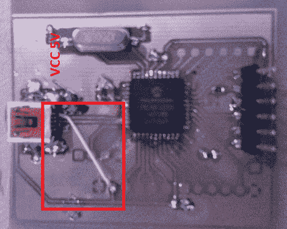

# PIC 18F4550 开发板

> 原文：<https://hackaday.com/2012/08/17/pic-18f4550-dev-board/>

[Natsfr]正在寻找一种单面 PCB 来容纳 PIC 18F4550。没有找到一个，他在 Kicad 设计了自己的，并分享他的劳动成果。

这种芯片具有 USB 功能，这就是为什么我们看到它被用于一吨的项目。几乎所有的(包括[这个 USB 输入设备 post](http://hackaday.com/2010/03/21/pic-based-usb-input-devices/) )都采用了非常大的 DIP 封装。[Natsfr]走了一条不同的路线，为 TQFP 包装设计，以保持最低限度的钻井。布局包括一个晶体和 USB 迷你端口，但它也打破了芯片上的 I/O 引脚。上面的红框显示了他在 VCC 线上使用的快速修复方法，因为电路板走线在 USB 插孔外壳上短路。

他没有为这个原型上的大多数分线销钻孔。只有一个头部用于编程 PIC 芯片。但他确实对第一届董事会有一些计划。他要用【德州人的】 [AVR 编程固件给 PIC](https://github.com/texane/picisp) 把它变成 USB AVR ISP 编程器。