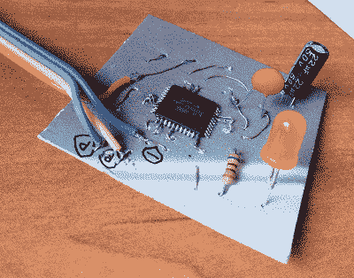

# 用 ISP 编程 XMEGA

> 原文：<https://hackaday.com/2012/08/19/programming-the-xmega-with-an-isp/>

Atmel 的 XMEGA 系列微控制器是小巧的硬件；凭借非常快的时钟、大量的 IO、USB 和多达 8 个 UART 端口，这些小巧的芯片充当了 AVR 和 pic 与市场上即将推出的非常强大的 ARM 芯片之间的桥梁。不幸的是，XMEGAs 不使用几乎每个 AVR 开发板上都有的极其常见的 ISP 编程头，这使得它们很难编程。波兰的[Szu]想出了一个非常简单的方法来对这些芯片进行编程，同时使用你手头已经有的编程硬件。

[Szu]的构建使用了一些电阻和二极管来断开与 XMEGA 的[PDI 接口](http://support.atmel.com/bin/customer.exe?=&action=viewKbEntry&id=683)的 USBASP 连接。在软件方面，[Szu]编写了一个 USBASP 固件更新，允许它对 PDI 设备进行编程，并且还为 AVRdude 编写了一个补丁，允许从命令行上传固件。

这是一个非常酷的构建，它允许非常非常强大的设备基于您已经编写的 AVR 代码进行构建。