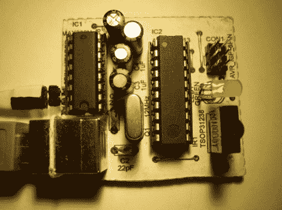

# 红外遥控器作为电脑输入

> 原文：<https://hackaday.com/2012/08/20/ir-remote-as-pc-input/>

作为一次学习经历，[GeriBoss]为他的 PC 组装了一个红外遥控接收器板。他想要从房间的另一边控制音量，这足以成为他进行这个项目的理由，在这个过程中，他开始使用 38 kHz 的接收器模块和曼彻斯特编码。

该项目的解码器部分是围绕 ATtiny2313 芯片构建的。外部中断引脚(INT0)连接到 TSOP31238。当它解码一个有效的远程代码时，它将一个字符推送到连接到计算机串行端口的 RS232 芯片。

我们认为这对[GeriBoss]来说是一个了不起的成就，但我们鼓励他进一步完善设计。您会注意到，在图像中，板上有一个 USB 端口，仅用于提供稳压电源。我们知道有可能在 ATtiny2313 上使用 V-USB 来添加 USB 功能，这将是了解它的一个很好的方式。我们还想提一下建议用于过滤红外接收器模块信号的电阻和电容。休息之后，我们将该器件的推荐应用原理图包括在内。

