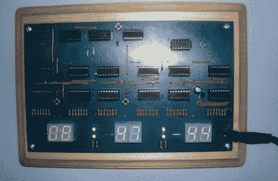

# CMOS 逻辑时钟跟踪 24 小时时间

> 原文：<https://hackaday.com/2012/08/20/cmos-logic-clock-tracks-24-hour-time/>

这是一个显示 24 小时时间的 IC 逻辑项目。规划是这个项目的关键。[Mattosx]花时间将他的设计布局为 PCB，以避免在构建点对点连接时的[布线噩梦](http://hackaday.com/2012/06/28/building-a-cmos-clock-on-a-breadboard/)。

大部分复杂性是由显示器本身造成的。六位数字中的每一位都有自己的二进制编码的十进制芯片和分立电阻阵列。计时由六个十进制计数器、两个分频器芯片、一个与门芯片和一个或门芯片处理。他选择了一个 SOIC 晶体振荡器芯片作为时钟信号。我们更倾向于使用电源电压作为时钟信号的想法。

[Mattosx]如果您想蚀刻自己的 5”x8”PCB，请贴上电路板插图。只要确保你通读了他所有的笔记，因为不是所有的芯片都朝向同一个方向。

[via [Reddit](http://www.reddit.com/r/electronics/comments/yfmcu/24_hour_digital_clock_with_basic_cmos_chips/)