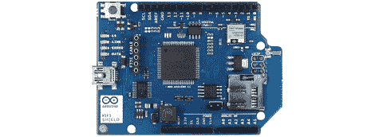

# 提供 Arduino WiFi 盾，价格 85 美元

> 原文：<https://hackaday.com/2012/08/21/arduino-wifi-shield-available-costs-85-usd/>

在 Arduino 博客上，官方发布了 Arduino WiFi 盾[。在这个 WiFi 盾的](http://arduino.cc/blog/2012/08/16/the-arduino-wifi-shield-is-now-available/)[规格页](http://arduino.cc/en/Main/ArduinoWiFiShield)上。我们可以看到这个新的董事会并不懒散；它由 32 位 ATMega 32UC3 微控制器供电，提供 WEP 和 WPA2 加密，并通过 [Arduino WiFi 库](http://arduino.cc/en/Reference/WiFi)支持 TCP 和 UDP。Arduino 商店的售价也是 69 欧元/85 美元/ 55 欧元。

现在，Arduino WiFi shield 的发布已经结束，我们将借此机会介绍几款不贵的 Arduino WiFi 适配器。

来自 Sparkfun 的 WiFi shield[是一个 WiFi 适配器，其外形与曾经流行的 XBee 模块相同。当然，你也可以制作自己的分线板；WiFly 只需要一个 TX、RX、电源和接地连接即可将您的 Arduino 项目连接到互联网。](https://www.sparkfun.com/products/10822)

我们已经看到一些项目使用了来自 async labs 的 [WiShield。这是一个 WiFi 模块，封装在熟悉的 Arduino shield 外形中，售价 55 美元。](http://asynclabs.com/store?page=shop.product_details&flypage=flypage.tpl&product_id=26&category_id=6)

对于铁杆黑客来说，你总是可以得到一个[裸微芯片 WiFi 模块](http://www.newark.com/microchip/mrf24wb0ma-rm/wi-fi-802-11-module-w-pcb-ant/dp/76R6666)并让它与 AVR 一起工作，就像[奎因·邓基]试图做的那样。平心而论，[奎因]试图去 Arduinofy 的无线图书馆；如果您不介意 Arduino 代码在您的项目中漫游，这种方法可能会奏效。

还有非常非常酷的 T2 电动小汽车 T3。基本上就是一个内置 WiFi 模块的 SD 卡。在通过手持智能手机屏幕上闪烁的图案来配置 Imp 之后，这款设备可以充当通往我们一直听说的神奇“云”的透明桥梁。电动 Imp 本应在 7 月底/8 月初发布，当这款酷炫设备真正发布时，我们会发布一个帖子。

当然，我们忽略了在 Arduino 项目上运行 WiFi 的最简单的解决方案:[只需使用无线路由器](http://hackaday.com/2012/06/12/nah-you-dont-need-an-ethernet-module-for-your-arduino/)。实际上，您需要的只是一对 TX 和 RX 引脚和一份 OpenWRT。简单，而且你可能有必要的硬件。

我们遗漏了几个 Arduino 化 WiFi 连接(或 WiFi 化 Arduino…)的方法，但我们会让读者在评论中完成我们开始的内容。