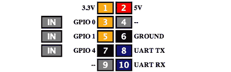

# 在浏览器中控制 Raspi GPIO 引脚

> 原文：<https://hackaday.com/2012/08/22/control-raspi-gpio-pins-in-the-browser/>

现在，【Eric】想出了一种方法[在浏览器](http://trouch.com/2012/08/21/webiopi-control-your-pis-gpio-with-a-browser/)中控制他的 Raspberry Pi 上的 GPIO 管脚，而不是让 Python 或 PHP 来为你服务。

[Eric]称他的项目为 WebIOPi，如果你想通过互联网闪烁 LED 或控制继电器，这是一个完美的工具。只需将他的浏览器指向他的 Raspi 的 IP 地址，[Eric]就可以直接从他的桌面浏览器打开和关闭 GPIO 引脚。

WebIOPi 的所有代码都可以在[【Eric】的谷歌代码页](http://code.google.com/p/webiopi/)上找到。[Eric]项目的用户界面是完全可定制的，所以完全可以通过智能手机控制你的车库门，只需加载你的 Raspi 上的网页并按下按钮。

目前，WebIOPi 只能打开和关闭 GPIO 引脚。随着[Eric]在他的项目中实现 UART、SPI 和 I2C，这种情况将会改变，使得无需编写太多代码就可以做很多很酷的事情成为可能。