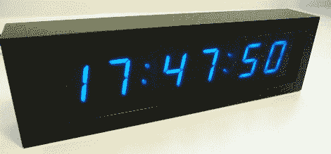

# 家庭媒体中心的网络时钟

> 原文：<https://hackaday.com/2012/08/22/network-time-clock-for-a-home-media-center/>

[Derek]想为他的媒体中心买一个时钟。一个简单的愿望，但他有几个要求:他不需要一个闹钟，希望它在停电后自动设置时间，需要一个大显示屏，还希望它好看。逛了一圈后，[德里克]找不到符合他要求的时钟，所以他决定做一个。

[Derek]的项目叫做 SNTP 钟。正如你所料，它的名字来源于用来自动同步你的计算机时钟和其他网络时间服务器的协议。时钟本身是围绕一个 ATMega168 构建的，在一个 [Lantronics XPort](http://www.lantronix.com/device-networking/embedded-device-servers/xport.html) 的帮助下从互联网上收集时间数据。一英寸七段 led 用作时钟的显示器，以及一切，从 UTC 的时间偏移，显示器的亮度，以及时钟显示 12 小时还是 24 小时时间是由红外苹果遥控器控制的。

裸露的 PCB 或电线束在[Derek]的媒体架上看起来不合适，所以他用金属相框和烟熏丙烯酸树脂来装饰他的时钟。现在，他有了一个漂亮优雅的时钟，正好适合他的媒体服务器和接收器。