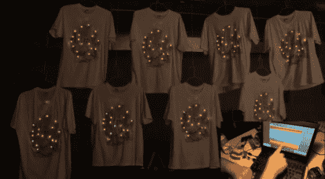

# 10bitworks 向我们展示了如何点亮一群同步发光的水母

> 原文：<https://hackaday.com/2012/08/24/10bitworks-shows-us-how-to-light-up-a-synchronized-swarm-of-led-jellyfish/>

来自 10bitworks 的[Jeremy Zunker]最近[来信分享了该团队为今年 3 月举行的 Luminaria 2012 音乐节](http://10bitworks.com/wiki/doku.php/ledshirts)所做的一个很酷的构建。你可能已经猜到了，这个节日是各种各样以光为主题的项目的家园，所以 10bitworks 的团队想了很久，很难想出一个设计来帮助他们从其他 79 个特色艺术家中脱颖而出。

他们项目的核心是一件 t 恤，上面画着一名被一群水母包围的深海潜水员。每只水母都由一个 LED 模块背光照明，这使得该团队可以在衬衫上创建复杂的灯光图案。

10bitworks 带来了 8 件衬衫，每件都配有一个小控制包，其中包含一组电池和一个 Jeenode 无线板。第九个 Jeenode 和一个大型天线被用作主控单元，向每件 t 恤发送信号，以同步灯光显示。

正如你在下面的视频中看到的，最终的结果非常好，其中[Jeremy]详细介绍了该项目的所有细节。

[https://www.youtube.com/embed/raDpGZVuk5E?version=3&rel=1&showsearch=0&showinfo=1&iv_load_policy=1&fs=1&hl=en-US&autohide=2&wmode=transparent](https://www.youtube.com/embed/raDpGZVuk5E?version=3&rel=1&showsearch=0&showinfo=1&iv_load_policy=1&fs=1&hl=en-US&autohide=2&wmode=transparent)