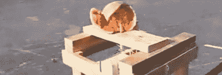

# 成为你心目中的加拉格尔

> 原文：<https://hackaday.com/2012/08/27/becoming-gallagher-in-your-mind/>

路易斯维尔 hackerspace LVL1 的人们创造了你所见过的最方便、最时髦的厨房工具。它不是切片机，不是切片机，也不是切碎机或料斗；这是……[一个星球大战原力训练器，它能炸掉西瓜](http://www.lvl1.org/2012/08/23/mind-over-melon-on-whas-great-day-live/)。

该项目名为“思想超越甜瓜”，是由 LVL1 的[克里斯]和[布拉德]在上周末的伯恩海姆音乐节上为[CONNECT 创作的。建造背后的想法是让人们使用星球大战原力训练器脑电图玩具用意念炸西瓜。](http://www.bernheim.org/connect.html)

该建筑的特点是原力训练器连接到 XBee 模块，无线连接到西瓜毁灭的地面零点。当该设备的操作者非常努力地集中注意力时，一系列的发光二极管点亮，一个螺线管将压缩二氧化碳注入西瓜中。

[Brad]告诉我们，LVL1 wiki 将很快提供构建您自己的精神雪橇的说明，但在此之前，请欣赏 WHAS11 news 上的这段视频。