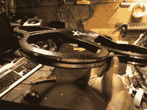
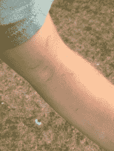

# 休克龙；令人震惊的 AR 无人机模型

> 原文：<https://hackaday.com/2012/08/27/the-taserdrone-a-shocking-mod-for-the-ar-drone/>

[https://www.youtube.com/embed/sYdNnzAgScY?version=3&rel=1&showsearch=0&showinfo=1&iv_load_policy=1&fs=1&hl=en-US&autohide=2&wmode=transparent](https://www.youtube.com/embed/sYdNnzAgScY?version=3&rel=1&showsearch=0&showinfo=1&iv_load_policy=1&fs=1&hl=en-US&autohide=2&wmode=transparent)
你们都见过用一次性相机制成的类似泰瑟枪的装置。我们见过他们[装上橡胶手套](http://hackaday.com/2011/08/22/video-shocking-jack-into-submission-with-high-voltage/)、[指尖](http://hackaday.com/2011/10/20/taser-gloves-are-a-bad-idea/)，甚至[土豆枪弹药](http://hackaday.com/2008/07/10/taser-ammo-for-your-spud-gun/)！我们还没有在四轴飞行器上见过它们。一旦我们有了一个可以玩的，这个问题很快就被解决了。来认识一下 *shockerDrone，*一款内置电击附件的 Parrot AR 无人机。

为了增加令人震惊的附件，我们必须尽可能减轻重量。为了做到这一点，所有的贴纸和额外的材料都从 AR 无人机的“室内”外壳上移除。我们选择了室内版本，因为它有一个延伸到叶片外面的夜灯框架来保护叶片。这是让它撞到人的完美时机。

然后我们在整个船体周围用铝带做了两条轨道。这些用电线直接连接到一次性相机的电容器上。另一个减轻重量的方法是去掉相机的所有无关部件。这不仅使它更轻，而且允许整个电路隐藏在船体内部。只需要一点点雕刻就能创造出足够的空间。

正如你在视频中看到的，它确实提供了一个冲击，但没有强大到足以击倒你。我们勇敢的实验对象[Jared]被击中了几次，似乎挺过了考验。话说回来，他是一名电工，可能在日常工作中遇到过更糟糕的情况。我不小心把它抱在手臂里，以为它已经排出去了，结果排出了很长时间，弄破了皮肤。你可以在下面看到它的图片。

我有一个想法，一个有趣的游戏将是“从电击中抓取美钞”，但 ar 无人机[不像我们见过的其他一些设备](http://hackaday.com/2012/08/24/the-100-tri-copter/)那样灵活，人们能够抓取美钞而没有太多机会被电击。

