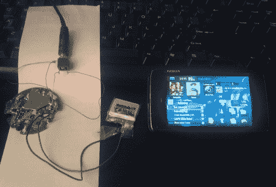

# 将您的旧蓝牙耳机变成一个 DIY 汽车音频接收器

> 原文：<https://hackaday.com/2012/08/28/turn-your-old-bluetooth-headphones-into-a-diy-car-audio-receiver/>

[Tim]驾驶一辆 1995 年三菱 TS Magna，该车配备了一个他亲切地称之为“贫困包”的不太出色的附件包。他为自己的座驾配备了一个支持蓝牙 A2DP 配置文件的售后主机，前提是他购买了 Pioneer 出售的价格高得离谱的套件。他不愿意花比他的汽车价值更多的钱来买一套音响设备，他以远低于先锋公司要价的价格迅速制造了自己的蓝牙设备。

他有一套他愿意卖掉的诺基亚蓝牙耳机，所以他把它们拆开，看看如何与他的汽车音响连接。将耳机连接到他的耳机是一项相对简单的任务，但他必须更加努力才能让他的蓝牙接收器正常工作。

在对他的无线音频设备进行了两次低估和几乎彻底改造后，[Tim]设法让事情按照他的喜好运行。他说，音频比他现在想要的要安静一些，所以他可能会在不久的将来修改他的设计。然而现在，他可以在镇上巡游的时候从手机上下载音乐。