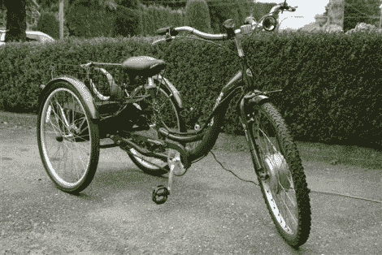

# 使这个自行车机动化

> 原文：<https://hackaday.com/2012/08/28/motorizing-this-trycicle/>

在 8 月 11 日的国际黑客日期间，Kaj 想帮助一位年迈的家庭成员，为他们制造一辆电动三轮车。他将一些重复使用的零件与一些新零件混合在一起，最终制造出了一辆可以让骑车者拖拽其他骑车者的自行车。显然，当严肃的骑手看到一个骑三轮车的老人追上他们时，他们会疯狂地踩踏板，以确保他们不会遭受被超越的尴尬。但是它有足够的动力和里程来超越最强的非动力竞争对手。

许多零件来自克雷格清单上出售的一辆不起作用的电动自行车。[Kaj]报道说自行车被毁坏了，但是马达系统大部分是可修复的。他更换了电池和充电器，并把马达接上了后轮轴。最初的安装把除了马达以外的所有东西都放在骑手身后的篮子里。重量和位置使它在转弯时不稳定。解决方案是把电池放在工具箱里，绑在篮子下面。较低的重心确保三轮车易于搬运，现在篮子里仍有空间放你的杂货。

这将为水中印刷的道路信息提供一个完美的平台。